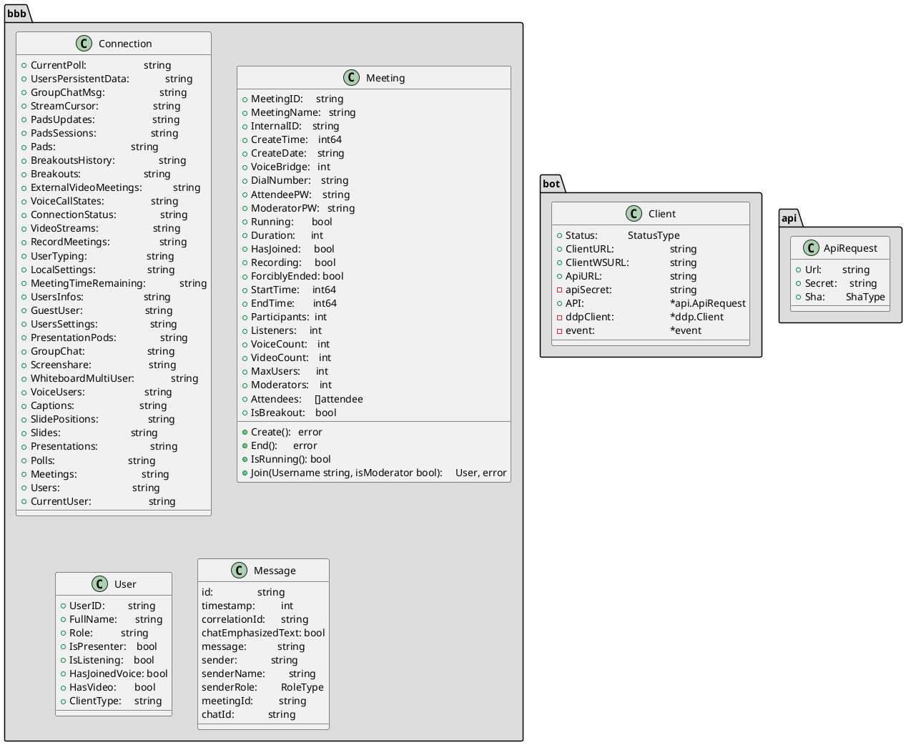

# bigbluebutton-bot

```plantuml
@startuml
package bbb #DDDDDD {
    class Connection {
        + CurrentPoll:                      string
        ' + StreamAnnotations:                string'
        + UsersPersistentData:              string
        + GroupChatMsg:                     string
        + StreamCursor:                     string
        + PadsUpdates:                      string
        + PadsSessions:                     string
        + Pads:                             string
        + BreakoutsHistory:                 string
        + Breakouts:                        string
        + ExternalVideoMeetings:            string
        + VoiceCallStates:                  string
        + ConnectionStatus:                 string
        + VideoStreams:                     string
        + RecordMeetings:                   string
        + UserTyping:                       string
        + LocalSettings:                    string
        + MeetingTimeRemaining:             string
        + UsersInfos:                       string
        + GuestUser:                        string
        + UsersSettings:                    string
        + PresentationPods:                 string
        + GroupChat:                        string
        + Screenshare:                      string
        + WhiteboardMultiUser:              string
        + VoiceUsers:                       string
        + Captions:                         string
        + SlidePositions:                   string
        + Slides:                           string
        + Presentations:                    string
        + Polls:                            string
        + Meetings:                         string
        + Users:                            string
        + CurrentUser:                      string
        ' + MeteorAutoUpdateClientVersions:   string'
    }

    ' class Recording {
    '     + MeetingID:     string
    ' }

    class Meeting {
        + MeetingID:     string
        + MeetingName:   string
        + InternalID:    string
        + CreateTime:    int64
        + CreateDate:    string
        + VoiceBridge:   int
        + DialNumber:    string
        + AttendeePW:    string
        + ModeratorPW:   string
        + Running:       bool
        + Duration:      int
        + HasJoined:     bool
        + Recording:     bool
        + ForciblyEnded: bool
        + StartTime:     int64
        + EndTime:       int64
        + Participants:  int
        + Listeners:     int
        + VoiceCount:    int
        + VideoCount:    int
        + MaxUsers:      int
        + Moderators:    int
        + Attendees:     []attendee
        '+  Metadata:      metadata'
        + IsBreakout:    bool

        + Create():   error
        + End():      error
        + IsRunning(): bool
        + Join(Username string, isModerator bool):     User, error

    }
    
    class User {
        + UserID:         string
        + FullName:       string
        + Role:           string
        + IsPresenter:    bool
        + IsListening:    bool
        + HasJoinedVoice: bool
        + HasVideo:       bool
        + ClientType:     string
    }

    class Message {
        id:                 string
        timestamp:          int
        correlationId:      string
        chatEmphasizedText: bool
        message:            string
        sender:             string
        senderName:         string
        senderRole:         RoleType
        meetingId:          string
        chatId:             string
    }
}

package bot #DDDDDD {
    class Client {
        + Status: 	        StatusType
        + ClientURL:			string
        + ClientWSURL:		string
        + ApiURL:				string
        - apiSecret:			string
        + API: 				*api.ApiRequest
        - ddpClient: 			*ddp.Client
        - event: 				*event
    }
}

package api #DDDDDD {
    class ApiRequest {
        + Url:        string
        + Secret:     string
        + Sha:        ShaType
    }
}

@enduml
```