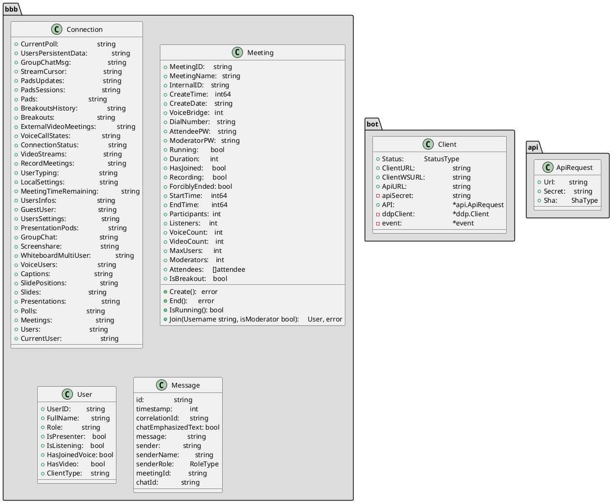

# bigbluebutton-bot



All subscriptions:
```go
	err = c.ddpClient.Sub("users")
	if err != nil {
		panic("")
	}
	if err != nil {
        panic("")
    }
	err = c.ddpClient.Sub("polls")
    if err != nil {
        panic("")
    }
	err = c.ddpClient.Sub("presentations")
    if err != nil {
        panic("")
    }
	err = c.ddpClient.Sub("slides")
    if err != nil {
        panic("")
    }
	err = c.ddpClient.Sub("slide-positions")
    if err != nil {
        panic("")
    }
	err = c.ddpClient.Sub("captions")
    if err != nil {
        panic("")
    }
	err = c.ddpClient.Sub("voiceUsers")
    if err != nil {
        panic("")
    }
	err = c.ddpClient.Sub("whiteboard-multi-user")
    if err != nil {
        panic("")
    }
	err = c.ddpClient.Sub("screenshare")
    if err != nil {
        panic("")
    }
	err = c.ddpClient.Sub("group-chat")
    if err != nil {
        panic("")
    }
	err = c.ddpClient.Sub("presentation-pods")
    if err != nil {
        panic("")
    }
	err = c.ddpClient.Sub("users-settings")
    if err != nil {
        panic("")
    }
	err = c.ddpClient.Sub("guestUser")
    if err != nil {
        panic("")
    }
	err = c.ddpClient.Sub("users-infos")
    if err != nil {
        panic("")
    }
	err = c.ddpClient.Sub("meeting-time-remaining")
    if err != nil {
        panic("")
    }
	err = c.ddpClient.Sub("local-settings")
    if err != nil {
        panic("")
    }
	err = c.ddpClient.Sub("users-typing")
    if err != nil {
        panic("")
    }
	err = c.ddpClient.Sub("record-meetings")
    if err != nil {
        panic("")
    }
	err = c.ddpClient.Sub("video-streams")
    if err != nil {
        panic("")
    }
	err = c.ddpClient.Sub("connection-status")
    if err != nil {
        panic("")
    }
	err = c.ddpClient.Sub("voice-call-states")
    if err != nil {
        panic("")
    }
	err = c.ddpClient.Sub("external-video-meetings")
    if err != nil {
        panic("")
    }
	err = c.ddpClient.Sub("breakouts")
    if err != nil {
        panic("")
    }
	err = c.ddpClient.Sub("breakouts-history")
    if err != nil {
        panic("")
    }
	err = c.ddpClient.Sub("pads")
    if err != nil {
        panic("")
    }
	err = c.ddpClient.Sub("pads-sessions")
    if err != nil {
        panic("")
    }
	err = c.ddpClient.Sub("pads-updates")
    if err != nil {
        panic("")
    }

	type streamsettings struct {
		UseCollection bool		`json:"useCollection"`
		Args          []string	`json:"args"`
	}
	st := streamsettings{
		UseCollection: 	false,
		Args:		 	[]string{},
	}
	err = c.ddpClient.Sub("stream-cursor-" + internalMeetingID, "message", st)
    if err != nil {
        panic("stream-cursor-" + internalMeetingID)
    }
	err = c.ddpClient.Sub("stream-annotations-" + internalMeetingID, "removed", st)
    if err != nil {
        panic("")
    }
	err = c.ddpClient.Sub("stream-annotations-" + internalMeetingID, "added", st)
    if err != nil {
        panic("")
    }
	err = c.ddpClient.Sub("group-chat-msg", 0)
    if err != nil {
        panic("")
    }
	err = c.ddpClient.Sub("users-persistent-data")
    if err != nil {
        panic("")
    }
	err = c.ddpClient.Sub("current-poll", false, true)
    if err != nil {
        panic("")
    }
```